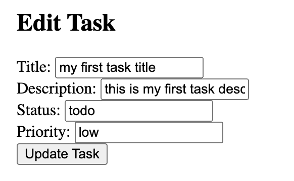

### Env setup

Make sure that you have Docker and docker compose installed on your machine.
If not installed refer to this docs:
https://docs.docker.com/compose/install/

### ENV variables:

all required envs are in the .env file which are:
`NODE_PORT=4000
NODE_JWT_SECRET=your-secret-key
REACT_PORT=3000
REACT_API_URL=http://localhost:4000
MONGO_DB_NAME=tryhackme
MONGO_URI=mongodb://mongo:27017`
This is a default setup
If you wish to make some changes please do so.
Make sure that `NODE_PORT` env and `REACT_API_URL` env share the same port

## Start project

to run the project please run this command from root of the project:
`docker-compose -f docker-compose.dev.yml up --build` or `docker-compose -f docker-compose.dev.yml up --build -d` if you want to run the containers in the background

Once the containers started you can visit browser via this url: `http://localhost:3000/` or via the port you provided in .env file for `REACT_PORT`

# About Task

Hi Angelika!
I appreciate the opportunity to complete the technical task within the given time frame. However, the scope of the full-stack application, especially with a focus on code quality, security, and UI aesthetics, is extensive and challenging to cover comprehensively in just 3 hours.

I aimed to deliver a functional application with as much attention to code quality, security practices, and user interface as possible within the given time constraints. I acknowledge that the provided solution is basic, and achieving a fully polished MVP, meeting all specified requirements, would indeed require more time, likely exceeding 10 hours.

In the interest of ensuring a high-quality submission, I suggest discussing certain aspects of the task during our call, such as architectural decisions, technology choices, and security practices. This would allow for a deeper understanding of my thought process and approach to the task, without compromising the overall quality of the deliverable within the tight time frame.

I am committed to delivering the best possible solution and would welcome the opportunity to further discuss and elaborate on my choices during our call. Thank you for understanding the challenges inherent in this task, and I look forward to our discussion.

# How to use APP:

This is how client application looks like:

## To add task:

1. Fill up this details. All fields required!

Status:
Add either: pending or completed (of course you can input anything in the input fields but those fields you wont be able to filter via the "Status" filter buttons)

Priority:
Add either: pending or completed (of course you can input anything in the input fields but those fields you wont be able to filter via the "Priority" filter buttons)

2. Press "Add Task" button and it will add the record to DB via API

Simple functionality done due to:

1. something to improve
2. lack of time

## How to search:

1. To search for tasks via description or title add your search key into "Enter your search query" field then press "Search" button
2. Pagination: input page number then press "Search" button
3. Filter via status or priority press these buttons:
   

## Edit

To edit task press on edit next to any task of your choice:

once pressed the edit section will appear at the top of the page:

Edit the fields you need to edit and then press "Update" button to update the record

## Delete

just simply press delete button next to the task that you want to delete

## Login

To login enter username and password
the password is not required therefore you can register simply with username

To register press register link

the password is not required therefore you can register simply with username once submited press login
